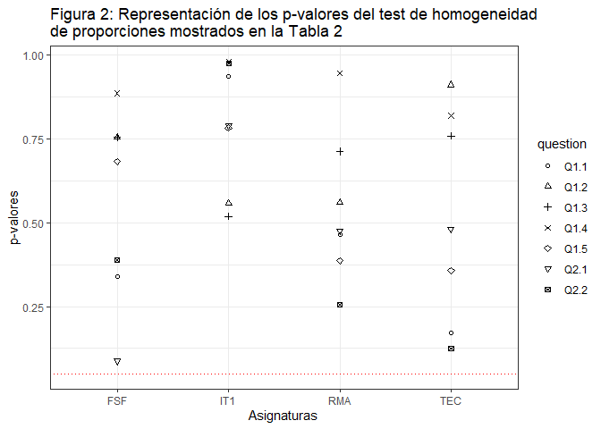
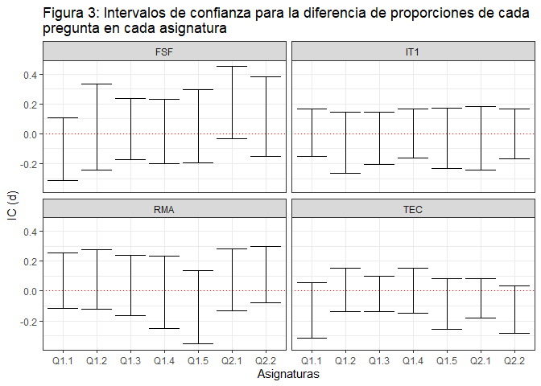

## ABSTRACT

Las encuestas en escala Likert son las protagonistas indiscutibles en las evaluaciones docentes. Estas piden al estudiante evaluar su grado de conformidad con una serie de afirmaciones relativas a la docencia. En internet y las redes sociales, se usan mayoritariamente encuestas binarias, las cuales dan al encuestado solamente dos posibles respuestas, siendo una elección habitual el "me gusta" o "no me gusta". En el presente estudio, se pretende evaluar la puesta en marcha de encuestas dicotómicas en la evaluación docente. Para ello el estudiante ha realizado la misma encuesta en escala Likert y en formato dicotómico. Entre la realización de ambas se dejó una semana de tiempo. Los resultados obtenidos demuestran que se puede extraer la misma información utilizando el formato Likert y el formato dicotómico. Cabe destacar que en los sistemas de calidad solamente se utiliza un valor agregado de la encuesta Likert, colapsando toda la información recogida en un solo número. Por ambas cosas, y dado que el estudiante está más familiarizado con este último caso, se anima a utilizar este formato dicotómico.

**Palabras Clave**: encuesta, alumnado, Likert, dicotómica

## 1. INTRODUCCIÓN

La evaluación de la actividad docente por parte de los estudiantes ocupa un lugar inamovible en la enseñanza universitaria. Hace décadas, la labor docente era realizada sin recoger la opinión de quien recibía la enseñanza. El estudiante no podía dar su valoración sobre las enseñanzas recibidas. Ello dificultaba el tener algún tipo  de registro sobre la calidad de las clases impartidas. En aras de la mejora, es necesario medir. En otras palabras, lo que no se mide, no se puede mejorar. La medida recogida por las encuestas puede ser utilizada o no por el docente para ser autocrítico con su labor. Además, ello ha permitido dar voz al estudiante. Es cierto que el alumno puede dejarse llevar por sus emociones en la evaluación, pero no se puede menoscabar este instrumento aludiendo a un mal uso generalizado. La evaluación docente es una poderosa herramienta que ha de ser utilizada responsablemente por parte de todas las partes implicadas.
La escala de Likert fue publicada por el educador y psicólogo Rensis Likert en 1932. Se emplea habitualmente en investigaciones de psicología, sociología, negocios y marketing que utilizan cuestionarios de opinión como fuente de datos. Esta mide el nivel de acuerdo o desacuerdo para una afirmación, utilizándose una escala simétrica. En otras palabras, captura la intensidad del sentimiento hacia un enunciado. Se puede crear una escala utilizando el promedio de las respuestas a un cuestionario. El hacerlo, lleva asociada una hipótesis que no se puede obviar: se asume que las distancias entre cada opción disponible son iguales. Esto puede ser cuestionable, puesto que cada persona tiene su propia escala interna asociada a sus sentimientos. Aunque se da por hecho cierta similitud debido al significado común de las palabras que forman el lenguaje. Otro punto de debate reside en el número de opciones a utilizar y su naturaleza par. Se puede utilizar una escala con un número par de opciones de respuesta (elección forzada) o un número impar (neutral). Por ejemplo, si existiesen cinco valores, la elección neutral sería la tercera donde no hay posicionamiento claramente favorable o desfavorable. La opción neutral se suele ver como la opción tomada por la persona encuestada cuando no está segura. Es cuestionable si es una opción verdaderamente neutral, puesto que se aproximaría más a una "no sabe / no contesta". Este tipo de escala Likert de cinco opciones suele utilizarse en el ámbito de la Educación.
Otro uso de las aplicaciones de los resultados obtenidos por las encuestas docentes reside en los procedimientos de calidad. A día de hoy, la calidad ocupa un lugar primordial en las enseñanzas universitarias. Son varios los sellos de calidad existentes y, para ello, se recopilan las evaluaciones docentes a lo largo de los años. En los procesos de calidad a los cuales se ha podido acceder, se utiliza la media de la puntuación obtenida para constatar la tendencia temporal de los diferentes apartados. Se busca la mejora continua. Resulta llamativo cómo se utilizan las respuestas obtenidas en la escala Likert: se usa el valor esperado de los valores numéricos recogidos, de tal forma que toda la información queda reducida a un solo número representativo. También hay que destacar que este es el procedimiento menos farragoso y más habitual para registrar la progresión temporal. Sería realmente complejo utilizar una métrica compuesta de varios agregados para evaluar la tendencia. La puntuación media puede considerarse un porcentaje de un máximo. Por ejemplo, obtener un promedio de 3 sobre 5 es equivalente a obtener un 60 % del máximo posible. ¿Será esto el equivalente a obtener un 60 % de "me gusta" en una pregunta dicotómica?  
Desde hace unos años, estamos sometidos varias veces al día a encuestas dicotómicas sin darnos cuenta. En las redes sociales, suelen habilitarse dos iconos en forma de pulgar arriba o pulgar abajo para que el usuario evalúe una publicación. Hay grandes plataformas de ocio que cambiaron su forma de evaluar de una escala Likert a una escala dicotómica. Ello indica que la información arrojada por una encuesta binaria es suficiente para mejorar un producto o un servicio. Estrictamente hablando, se le dan al usuario tres opciones: me gusta, no me gusta y no contestar. Sin embargo, a la hora de compararlo con las encuestas de evaluación docentes, al estudiante se le pide que evalúe todo aquello que pueda. No se le menciona explícitamente la opción de dejar el apartado en blanco.
¿Por qué plantearse el uso de las encuestas "me gusta / no me gusta"? Son varias las mejoras que puede aportar al proceso. La principal ventaja es la familiaridad del estudiante con su uso por utilizarlas a diario. Debido a ello, completarán las encuestas de forma más cómoda y más rápida, predisponiendo al estudiante a su uso. Además, la persona usuaria se ve obligada a polarizar su opinión. Es ella misma la que realiza un proceso de redondeo. No se le da opción a una respuesta neutral. Esto también puede verse como una desventaja. Se está perdiendo información en la recogida de opinión, puesto que se le dan dos opciones solamente. Sin embargo, tal y como se comentó, debido al uso final que se da de los resultados obtenidos en los procesos de calidad, esa pérdida resulta asumible. Por una parte, estaría el valor esperado, transformable a un ratio de éxito; por el otro, está el ratio de "me gusta / total". Ambas métricas pueden compararse, puesto que la información que aporta es muy similar.
Este trabajo compara la información que se puede extraer de dos encuestas cuya única diferencia reside en la respuesta. En uno de los casos se utilizó la escala Likert y en el otro la escala dicotómica "me gusta / no me gusta". Las asignaturas utilizadas corresponden al primer cuatrimestre del curso académico 2019-2020 del Grado de Ingeniería Mecánica impartido en el Centro Universitario de la Defensa en la Escuela Naval Militar (CUD-ENM).  Se analizaron los datos aportados, pre-procesándolos para permitir su comparación y realizándose un estudio estadístico al respecto}. Los resultados obtenidos demuestran que la información aportada por las encuestas dicotómicas es equivalente a las Likert, habida cuenta del manejo la información obtenida.


## 2. METODOLOGÍA

El problema a estudiar es si la escala influye en el entrevistado a la hora de responder a una pregunta, no pudiendo considerar similar la información aportada por ambos tipos de encuesta (Likert y dicotómica); o, por el contrario, no resulta relevante el tipo de escala a utilizar, lo que implicaría una justificación en favor de realizar encuestas de tipo dicotómico. Para realizar este estudio, se realizaron una serie de preguntas relacionadas con la asignatura en escala Likert y en escala dicotómica (Figura 1). Ambas encuestas estaban formadas por las mismas preguntas. Para poder comparar ambos resultados mediante un análisis estadístico, se hizo necesario transformar los resultados de la escala Likert a escala dicotómica. Esta sección explica en detalle cada uno de los citados pasos.

<!--- En formato html para poder redimensionarlo -->
<p align="center">

</p>


### 2.1 Encuestas


Se usaron varias encuestas pertenecientes a asignaturas del primer cuatrimestre del del Grado de Ingeniería Mecánica del CUD-ENM relativas al curso académico 2019-20. En concreto, para llevar a cabo el estudio se tomaron cuatro asignaturas del ámbito STEM: Ingeniería Térmica I (IT1), Resistencia de Materiales (RMA), Teoría de Estructuras y Construcciones Industriales (TEC) y Fundamentos de Sistemas y Tecnologías de Fabricación (FSF). Las preguntas realizadas están detalladas en la Tabla 1.

Tabla 1 Preguntas realizadas en la escala Likert y formato dicotómico.

| **Código**	| **Pregunta** |
|:--------:|--------------------------------------------------------------------------------------------|
|Q1.1	|Esta materia es importante para mi formación|
|Q1.2	|Los créditos asignados a la materia guardan proporción con el volumen de trabajo programado para superarla| 
|Q1.3	|La guía docente (o programa) de la materia está disponible y es accesible con facilidad|
|Q1.4	|La guía docente (o programa) de la materia recoje los objetivos, contenidos la metodología, la bibliografía, el sistema de evaluación,... de forma comprensible y detallada |
|Q1.5	|La coordinación entre profesorado de la materia es adecuada. (Contestar sólo en caso de materias impartidas por más de un/a profesor/a)|
|Q2.1 |	Las condiciones (espacio, equipamiento, material, no alumnos/as, ...) en las que se desarrolla la docencia de esta materia en lo relativo a las CLASES TEÓRICAS son satisfactorias |
|Q2.2	|Las condiciones en las que se desarrolla la docencia de esta materia en lo relativo a las PRÁCTICAS (laboratorio, talleres de campo, ...) son satisfactorias|


Las encuestas en escala Likert fueron realizadas por la Universidad de Vigo, universidad a la que está adscrita el CUD-ENM y da validez al título de grado impartido. Las encuestas en escala binaria se llevaron a cabo mediante un formulario online. Se dejó pasar una semana entre la realización de ambas opciones. Las respuestas tenían que ser respondidas para dar finalizada la encuesta. Esta es la comparación más equitativa con las encuestas Likert utilizadas para evaluar la docencia por parte del alumnado.
Otra cuestión a tener en cuenta es que, en los datos relativos a la encuesta tipo Likert, se han contabilizado las respuestas para todos los profesores que imparten estas asignaturas, por lo que dichas frecuencias absolutas aluden a las respuestas dadas en varias ocasiones. Bajo el supuesto de que no existe variabilidad entre las respuestas dadas para cada profesor, se divide el número de respuestas totales obtenidas entre el número de profesores, redondeando al entero menor. En la Tabla 2 puede verse los datos recopilados para la asignatura FSF.


```r
datos = read.csv("datamanuscript.csv",sep=";")
datos=datos[datos$CUATRIMESTRE==1,]

data <- data.frame("ABREV"=datos$ABREVIATURA, "QUESTION"=datos$PREGUNTA,  "SI_L"=datos$P3+datos$P4+datos$P5, "NO_L"=datos$P1+datos$P2,"TOTAL_L"=datos$TOTAL_LIKERT, "SI_B"=datos$SI, "NO_B"=datos$NO, "TOTAL_B"=datos$TOTAL_DICOT)

knitr::kable(head(data,n=7), "simple", align = "lccccccc", caption ="Tabla 2 Tabla de frecuencias para la asignatura FSF donde SI_# (NO_#) es el nº de respuestas “favorables” (respuestas “desfavorables”) de la pregunta y TOTAL_# el nº total de respuestas en la encuesta #, con #  = L correspondiente a la escala Likert y # = B correspondiente a la escala dicotómica.")
```


Table: Tabla 2 Tabla de frecuencias para la asignatura FSF donde SI_# (NO_#) es el nº de respuestas “favorables” (respuestas “desfavorables”) de la pregunta y TOTAL_# el nº total de respuestas en la encuesta #, con #  = L correspondiente a la escala Likert y # = B correspondiente a la escala dicotómica.

|ABREV    |QUESTION    |SI_L    |NO_L    |TOTAL_L    |SI_B    |NO_B    |TOTAL_B|
|:------:  |:----------:  |:------:  |:------:  |:---------:  |:------:  |:------:  |:---------:|
|FSF        |Q1.1       |20      |74       |106       |1       |14       |17|    
|FSF        |Q1.2       |42      |53       |106       |8       |8        |17|    
|FSF        |Q1.3       |78      |17       |106       |16      |2        |18|    
|FSF        |Q1.4       |78      |17       |106       |14      |2        |17|    
|FSF        |Q1.5       |70      |24       |106       |13      |3        |17|    
|FSF        |Q2.1       |58      |34       |106       |14      |2        |17|    
|FSF        |Q2.2       |57      |37       |106       |12      |4        |17|    

Para llevar a cabo el estudio, en primer lugar, se hizo necesario realizar una reagrupación de respuestas "favorables" en la escala Likert, teniendo en cuenta que esto siempre implica una pérdida de información. Para ello, se realizó un análisis de la distribución de datos con el fin de determinar el punto de corte en esta escala. Para la transformación, fue necesario seleccionar una puntuación Likert a partir de la cual se considera una respuesta positiva. Por ejemplo, escogiendo la puntuación "2" como umbral, sumarían como respuestas positivas la "2, 3, 4 y 5". ¿Qué umbral habría que escoger? Puesto que se buscaba la semejanza, se realizó la transformación para todos los valores de umbral posible: esto es del 1 al 5. Después, se comparó pregunta a pregunta el ratio de SÍ/TOTAL así obtenido con el correspondiente de la encuesta binaria. De esta forma, se escogió el umbral "3" como aquel que transformó la encuesta Likert en una binaria lo más parecida posible a la recogida por la distribución obtenida.


```r
x1<-trunc(data$SI_L/3); y1<-trunc(data$NO_L/3); n1=x1+y1
x2<-data$SI_B; y2<-data$NO_B; n2=x2+y2
```

Finalmente, si se conociese cuál ha sido la respuesta de cada individuo en ambas encuestas, se podría considerar un diseño apareado (i.e. muestras relacionadas) y el análisis de resultados sería más cercano a la realidad de cara a evaluar la hipótesis. Este tipo de diseño no se ha considerado por dos motivos: 1) las encuestas han sido totalmente anónimas, tomando como punto de partida para este estudio una base de datos con las frecuencias absolutas de cada respuesta en cada pregunta; y 2) observando los tamaños muestrales, se verifica que no todos los individuos que respondieron en una encuesta, respondieron en la otra. Por todo ello, aunque las muestras se extraigan de la misma población, se pueden considerar independientes.

### 2.2 Procedimiento Estadístico

Bajo la pregunta de si aporta la misma información una encuesta binaria que la habitual en la escala Likert (recodificada a una binaria), tenemos que valorar si la proporción de respuestas favorables se pueden considerar las mismas en ambos tipos de encuesta o por el contrario, la encuesta Likert arroja diferencias en esta proporción con respecto a la binaria. Si la proporción de respuestas favorables son similares, implica que una encuesta con formato binario aportaría la misma información relevante que una encuesta de tipo Likert. Si, por el contrario, las proporciones fuesen distintas, ambas metodologías de cuestionario no serían comparables.

La variable de estudio que se presenta en una encuesta donde se contabiliza el "número de individuos que responden de forma favorable a una pregunta", se distribuye como una variable aleatoria binomial $x \sim B(n,p)$. Dicha variable está definida por dos parámetros: $n$ el número de individuos que componen la muestra extraída de la población de estudio y $p$ la proporción desconocida de individuos que responden de forma favorable a nivel poblacional. Podemos entonces considerar que tenemos las siguientes variables para cada pregunta en cada asignatura:

*  donde  será la proporción de respuestas "favorables" que ha obtenido dicha pregunta en la encuesta realizada en primer lugar y recodificada binaria.

*  donde  será la proporción de respuestas "favorables" que ha obtenido dicha pregunta en la encuesta dicotómica realizada en segundo lugar.


Se quiere determinar si las dos proporciones independientes de individuos que responden favorablemente en ambos tipos de encuesta  y  son similares o no. Para ello, fijado desde el inicio un nivel de significación , se plantea el procedimiento clásico de comparación de proporciones a través de un contraste de hipótesis del tipo (Ec 1).


Desde la perspectiva de la comparación de dos proporciones independientes, el método más utilizado es el test chi-cuadrado de Pearson (Plackett 1983). Sin embargo, dicho test tiene unas especificaciones iniciales bastante estrictas (debe verificarse que 5">; 5">) que en el caso de nuestros datos de estudio no se cumplen. En otras palabras, las frecuencias de las distintas clases deben ser suficientemente altas como para garantizar que pequeñas desviaciones aleatorias en la muestra no tengan importancia decisiva sobre el valor del estadístico de contraste. Es por ello que, para abordar el problema, se considera el parámetro poblacional diferencia , medida ampliamente utilizada en estadística aplicada a las Ciencias Sociales (Miettinen and Nurminen 1985; Newcombe 1998). De ahí, que el contraste de homogeneidad de proporciones, se pueda escribir como (Ec. 2).


Desde esta perspectiva, es sencillo demostrar que la diferencia muestral observada (estimador de máxima verosimilitud del parámetro ) se puede distribuir como una normal, pudiendo utilizar como medida del contraste el estadístico tipo Wald (Ec. 3).


La elección de dicha expresión viene determinada por su facilidad de cálculo y su buen comportamiento a nivel general, pudiéndose realizar un ajuste de los datos para los casos en los que los valores puedan ser extremos (probabilidades cercanas a 0 y a 1) (Agresti and Caffo 2000). Dicho procedimiento, siendo sencillo en su implementación directa, está ya recogido en diversos paquetes estadísticos del CRAN (Comprehensive R Archive Network) como, por ejemplo, en el paquete `prop.comb.RR` que se ha utilizado (Álvarez Hernández and Roca Pardiñas 2017). Aplicando los datos a la función correspondiente, nos ofrece como resultado el p-valor del método de Wald ajustado. Como es sabido, si dicho p-valor es inferior al nivel de significación establecido, implicaría rechazar la hipótesis nula y habría diferencias significativas entre las proporciones poblacionales. En caso contrario, se aceptaría la base planteada, concluyéndose que no hay evidencias de que las proporciones no puedan considerarse homogéneas.


```r
library(prop.comb.RR)

sol_pack=matrix(0,nrow=dim(data)[1],ncol=5)
lim_inf=sol_pack; lim_sup=sol_pack;

for(i in 1:dim(data)[1]){
  x0=c(x1[i],x2[i]); n0=c(n1[i],n2[i]); 
  result=prop.comb(x=x0, n=n0, alternative="two.sided", conf.level = 0.95)
  for(j in 1:5){
    if(result$inference[j,4]=="FALSE") result$inference[j,4]=0
    # guardamos el p-value del contraste de homogeneidad de proporciones
    sol_pack[i,j]=result$inference[j,4]
    # guardamos el IC para el parametro diferencia de proporciones
    lim_inf[i,j]=result$inference[j,1];      
    lim_sup[i,j]=result$inference[j,2]}}
```


## 3. RESULTADOS

Se muestran a continuación los resultados del contraste de hipótesis, exponiendo el resumen de p-valores de cada pregunta en cada asignatura en la Tabla 3. Se representan gráficamente dichos valores en la Figura 2 para mayor claridad, mostrando el nivel de significación nominal  con la línea punteada. Considerando los resultados en una asignatura concreta, por ejemplo, en la materia FSF se puede observar que los contrastes sobre todas y cada una de las preguntas son no significativos (p-valor \alpha">) pudiendo demostrar las diferencias entre las proporciones y aceptando la hipótesis nula. Analizadas todas y cada una de las asignaturas, vemos que la anterior conclusión es extensible al resto. Luego, se puede determinar que no existen diferencias significativas entre la proporción de individuos que responden de forma favorable con una primera encuesta (tipo Likert) y la proporción de individuos que responden de forma favorable con una segunda encuesta (tipo dicotómico). 


```r
B=round(sol_pack[,3],4)
C=t(matrix(B,nrow=7,ncol=4))
rownames(C)<-c("FSF","IT1","RMA","TEC") 
colnames(C)<-c("Q1.1","Q1.2","Q1.3","Q1.4","Q1.5","Q2.1","Q2.2")

knitr::kable(C, "simple", caption = "Tabla 3 Resultado del test de homogeneidad de proporciones para cada pregunta en cada asignatura")
```


Table: Tabla 3 Resultado del test de homogeneidad de proporciones para cada pregunta en cada asignatura

|Q1.1     |Q1.2     |Q1.3     |Q1.4     |Q1.5     |Q2.1     |Q2.2|
|:----:|:-------:|:-------:|:-------:|:-------:|:-------:|:-------:|:-------:|
|FSF    |0.3384   |0.7559   |0.7555   |0.8858   |0.6822   |0.0875   |0.3891|
|IT1    |0.9377   |0.5585   |0.5185   |0.9804   |0.7827   |0.7894   |0.9750|
|RMA    |0.4641   |0.5602   |0.7128   |0.9456   |0.3867   |0.4752   |0.2549|
|TEC    |0.1704   |0.9112   |0.7586   |0.8193   |0.3571   |0.4817   |0.1250|


```r
library(ggplot2)

col1=c(rep("FSF",7),rep("IT1",7),rep("RMA",7),rep("TEC",7))
col2=c(rep(colnames(C),4)); question=col2;

PV=data.frame(cbind(col1,col2,B))
colnames(PV)=c("Asignaturas","p-valores","Question")
Grafico = ggplot(PV) + geom_point(aes(x=col1, y=B, shape=question))  + scale_shape_manual(values=c(1:7)) + 
labs(x="Asignaturas",y="p-valores") + 
ggtitle("Figura 2: Representación de los p-valores del test de homogeneidad \nde proporciones mostrados en la Tabla 2") + theme_minimal() + geom_hline(yintercept=0.05,color="red",linetype="dotted") + theme_bw()
Grafico
```

<!-- -->


Adicionalmente, si se quiere estimar entre qué valores se encuentra la diferencia  poblacional en cada pregunta para cada asignatura, se pueden construir los intervalos de confianza (IC) a un nivel del  para cada caso. Así, habiendo obtenido los datos de interés (límite inferior y límite superior) a partir del proceso realizado en el punto anterior, se muestran en el gráfico Figura 3 los intervalos para cada asignatura y cada pregunta. Se puede observar que en todos los casos el valor de la diferencia nula está dentro de cada IC, como cabría esperar dadas las salidas obtenidas en los contrastes de hipótesis realizados.


```r
A1=round(lim_inf[,3],4); A2=round(lim_sup[,3],4)
par(mfrow=c(1,1))

dif_obs=x2/n2-x1/n1
diff=data.frame(col1,col2,dif_obs,A1,A2)

# Intervalos de confianza para cada asignatura
nn=factor(col2)
ggplot(diff, aes(nn,dif_obs,ymin=A1,ymax=A2)) + geom_errorbar() + facet_wrap(~col1) +
labs(x="Asignaturas",y="IC (d)") + 
ggtitle("Figura 3: Intervalos de confianza para la diferencia de proporciones de cada \npregunta en cada asignatura") + theme_minimal() + geom_hline(yintercept=0.0,color="red",linetype="dotted") + theme_bw()
```

<!-- -->


## 4. CONCLUSIONES

En este trabajo se ha analizado el uso de las encuestas dicotómicas como alternativa seria para la recopilación de la opinión del alumnado. Usualmente, suele utilizarse una encuesta de escala Likert para esta labor. Puede que considerarse que las encuestas Likert tienen más riqueza debido al mayor número de valores a elegir. Sin embargo, de acuerdo al estudio estadístico realizado para ambos tipos de encuesta, la proporción de respuestas “favorables” de un ítem se puede considerar similar entre aquellas en formato Likert y en formato dicotómico. Por tanto, parece razonable tender a un tipo de encuestas de tipo binario que son más sencillas de responder. Por todo ello, se recomienda el uso de las encuestas dicotómicas para agilizar la toma de opiniones del alumnado.

## AGRADECIMIENTOS
Los autores agradecen al Centro Universitario de la Defensa de la Academia Naval Española (CUD-ENM) todo el apoyo prestado para esta investigación.


## REFERENCIAS

- Agresti, Alan, and Brian Caffo. 2000. “Simple and Effective Confidence Intervals for Proportions and Differences of Proportions Result from Adding Two Successes and Two Failures.” The American Statistician 54 (4): 280. [https://doi.org/10.2307/2685779](https://doi.org/10.2307/2685779).

- Álvarez Hernández, María, and Javier Roca Pardiñas. 2017. “Prop.Comb.RR: Analyzing Combination of Proportions and Relative Risk.” 2017. [https://cran.r-project.org/web/packages/prop.comb.RR/index.html](https://cran.r-project.org/web/packages/prop.comb.RR/index.html).

- Miettinen, Olli, and Markku Nurminen. 1985. “Comparative Analysis of Two Rates.” Statistics in Medicine 4 (2): 213–26. [https://doi.org/10.1002/sim.4780040211](https://doi.org/10.1002/sim.4780040211).

- Newcombe, Robert G. 1998. “Interval Estimation for the Difference between Independent Proportions: Comparison of Eleven Methods.” Statistics in Medicine 17 (8): 873–90. [https://doi.org/10.1002/(SICI)1097-0258(19980430)17:8<873::AID-SIM779>3.0.CO;2-I](https://doi.org/10.1002/(SICI)1097-0258(19980430)17:8<873::AID-SIM779>3.0.CO;2-I).

- Plackett, R. L. 1983. “Karl Pearson and the Chi-Squared Test.” International Statistical Review / Revue Internationale de Statistique 51 (1): 59. [https://doi.org/10.2307/1402731](https://doi.org/10.2307/1402731).
